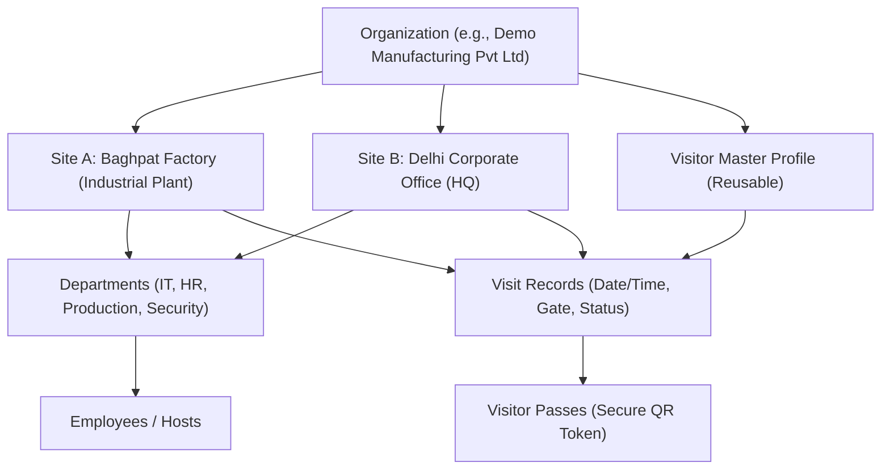
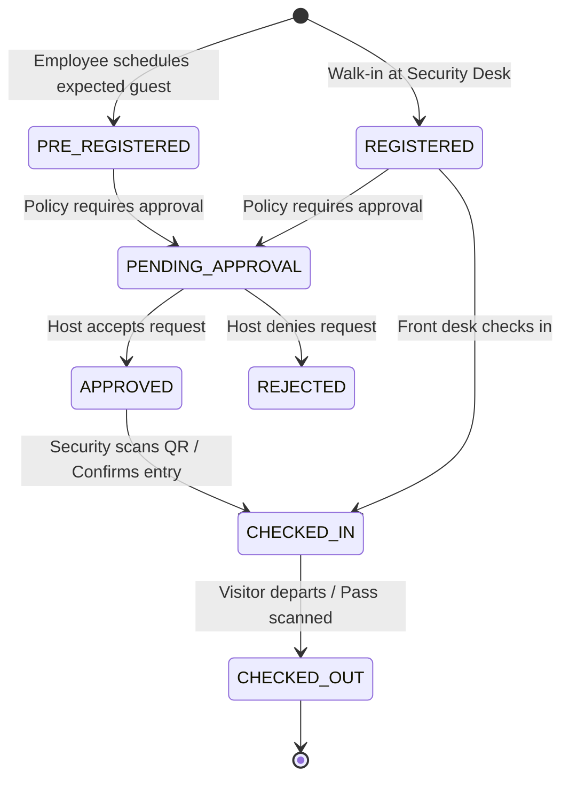

# Multi-Site Factory Visitor Management System (VMS) — Architecture Documentation

## 1. Executive Overview
The **Multi-Site Factory Visitor Management System (VMS)** is an enterprise-grade digital solution designed for industrial plants, manufacturing facilities, corporate headquarters, and multi-tenant campuses. It replaces insecure paper visitor logbooks with a secure, real-time, audit-compliant digital access system.

The system is architected as a **modular multi-site monolith** ready for seamless horizontal scaling and future migration to microservices or cloud container deployments (Kubernetes, AWS ECS, Google Cloud Run) without requiring architectural rewrites.

---

## 2. Core Architectural Principles

### 2.1 Multi-Site Organizational Hierarchy
Data and operations are partitioned across a clean multi-tenant hierarchical model:

- **Organization**: Top-level corporate tenant.
- **Sites**: Physical plant locations or corporate branches with distinct timezones, security gates, and policies.
- **Departments**: Functional divisions within sites (Production, Quality, IT, HR, Maintenance).
- **Employees**: Plant hosts and staff who can pre-register or approve visitors.
- **Visitors vs. Visits**: Separation of persistent visitor identity (reusable profile with photo, mobile, company) from visit transactions (specific entry timestamp, gate pass, vehicle, host).

---

## 3. Technology Stack

| Layer | Technology | Rationale |
| :--- | :--- | :--- |
| **Backend Runtime** | Node.js v20+ / TypeScript 5.7 (ES Modules) | Type-safe, high-concurrency event-driven I/O |
| **HTTP Framework** | Express.js 4.21 with Helmet, CORS, Rate-Limiting | High performance, lightweight, battle-tested middleware ecosystem |
| **Database** | PostgreSQL 16+ with UUID keys | ACID-compliant relational integrity, JSONB support, indexing |
| **Frontend Framework**| React 18 / TypeScript / Vite | Instant hot-reloading, component encapsulation |
| **Styling & Icons** | Tailwind CSS / Lucide React | Modern industrial aesthetic, responsive mobile-first utility classes |
| **State Management** | Zustand | Minimalist, high-performance client state management |
| **QR Code Engine** | `qrcode` (Node) & `qrcode.react` / `html5-qrcode` | High-entropy token generation & browser camera scanning |
| **PWA Layer** | `vite-plugin-pwa` (Workbox) | Offline shell caching, standalone tablet/mobile gate installation |
| **Badge Printing** | HTML5 `@media print` & `jspdf` | Standard A4 Visitor Passes & 4"x3" Thermal Sticky Badges |

---

## 4. Multi-Site Isolation & Security Architecture

### 4.1 Strict Site Resolution Mechanism
Every authenticated API request resolves the target factory site via:
1. **Header Injection**: Client sends `X-Site-Id: <UUID>`.
2. **Context Middleware Verification**: `siteContextMiddleware.ts` queries the user's session and verifies that the `X-Site-Id` exists in the authenticated user's `allowedSiteIds`.
3. **Database Scoping**: All database queries enforce strict filtering on `WHERE organization_id = :orgId AND site_id = :siteId`.

> [!IMPORTANT]
> A compromised or malicious client cannot access records from another site simply by modifying the `X-Site-Id` header; requests targeting unauthorized sites are immediately terminated with HTTP `403 Forbidden` (`UNAUTHORIZED_SITE_ACCESS`).

---

## 5. Visitor vs. Visit Entity Lifecycle

### 5.1 Reusable Visitor Identity
- A visitor's first registration creates a persistent record in `visitors`.
- On future visits, typing the visitor's mobile number triggers an instant lookup (`POST /api/visitors/lookup`), auto-filling their name, company, photograph, and past safety records.
- Blacklisting a visitor profile immediately flags all future entry attempts across all plant gates.

---

## 6. QR Code Security & Verification Flow

### 6.1 Zero-PII High-Entropy Token Architecture
To prevent QR tampering, replay attacks, or data harvesting:
- The QR code contains **NO sensitive Personal Identifiable Information (PII)**.
- It encodes only a 48-character cryptographic random hex token:
  `http://localhost:5173/v/qr_a7c89f2e3012b5d4e6...`
- The public verification route `/api/passes/verify/:token` queries the badge status and returns only sanitized display fields (Name, Company, Host, Plant Name, Status, Photo).
- When the visitor checks out at the gate, the pass status transitions to `USED`, immediately invalidating future scans.
