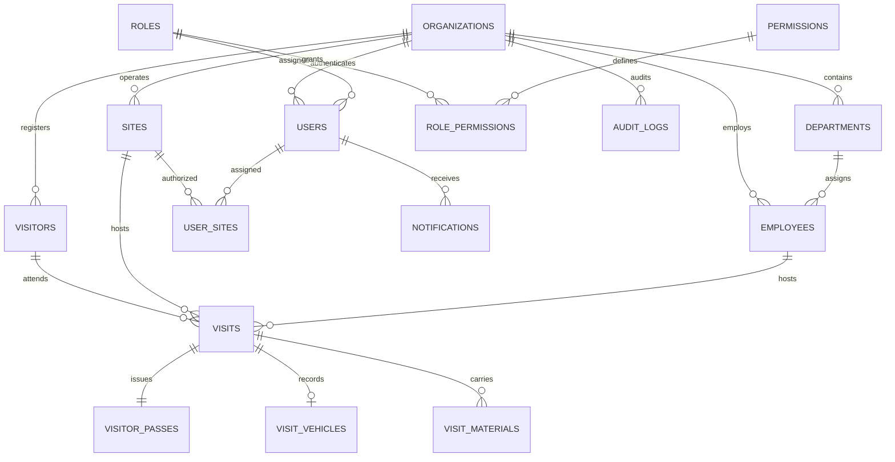

# Multi-Site Factory VMS — Database Architecture & Schema Reference

## 1. Overview
The database layer uses PostgreSQL with strict relational integrity, UUID primary keys for distributed multi-site compatibility, foreign key cascades, JSONB site configurations, and composite indexes optimized for high-volume gate lookups.

---

## 2. Entity Relationship Model (ER Diagram)

---

## 3. Database Tables Reference

### 3.1 Tenancy, Sites & Physical Checkpoints
- `organizations`: Root corporate entity with logo, code, and JSONB organizational settings.
- `sites`: Physical factory plant locations, timezone, address, coordinates, and local badge printing settings.
- `gates`: Physical security checkpoints and gates (Main Gate, Material Gate, Pedestrian Turnstile, Emergency Gate) with site foreign keys and unique constraint on `(site_id, code)`.

### 3.2 Access Control & Authorization (RBAC)
- `roles`: System and custom roles (`SUPER_ADMIN`, `ADMIN`, `SITE_ADMIN`, `SECURITY`, `RECEPTION`, `EMPLOYEE`).
- `permissions`: Granular permission flags (e.g. `visitor:create`, `visit:checkin`, `emergency:export`).
- `role_permissions`: Mapping of roles to granted permissions.
- `users`: User authentication accounts with bcrypt password hashes, failed login counters, and lockout timestamps.
- `user_sites`: Many-to-many site assignment allowing multi-site roving security managers.

### 3.3 Plant Directory & Staff
- `departments`: Organizational business units (Production, HR, IT, Quality Control, Maintenance).
- `employees`: Factory hosts with employee codes, phone numbers, and linked system user accounts (`user_id`).
- `employee_sites`: Factory sites where an employee is authorized to host visitors.

### 3.4 Visitor Identity & Transactions
- `visitors`: Reusable visitor profiles containing full names, mobile numbers, company names, ID types (masked), photos, and blacklisting status with reasons.
- `visits`: Transactional records of each visit event with statuses (`REGISTERED`, `PRE_REGISTERED`, `PENDING_APPROVAL`, `APPROVED`, `REJECTED`, `CHECKED_IN`, `CHECKED_OUT`, `CANCELLED`), accompanied by:
  - `entry_gate_id`: Designated or used entry gate checkpoint.
  - `exit_gate_id`: Designated or used exit gate checkpoint.
  - `emergency_muster_status`: Evacuation headcount tracking (`SAFE`, `MISSING`, `INJURED`, `NOT_VERIFIED`).
  - `assembly_point`: Assigned factory evacuation assembly area.
- `visitor_passes`: Security badge metadata containing unique pass numbers (`PASS-BGP-0001`), high-entropy QR tokens (`crypto.randomBytes(32).toString('hex')`), SHA-256 token hashes (`qr_token_hash`), validity timestamps, and print counters.
- `visit_vehicles`: Vehicle details (Two-Wheeler, Four-Wheeler, Truck) and registration numbers.
- `visit_materials`: Electronic items or incoming/outgoing assets brought on-site.
- `visit_approvals`: Audit history of host/manager approvals and rejections with timestamps and notes.

### 3.5 Security, Auditing & Notifications
- `audit_logs`: Immutable security ledger tracking all system logins, status changes, pass reprints, and profile modifications. Strengthened with:
  - `previous_hash`: Cryptographic SHA-256 hash of previous audit record.
  - `event_hash`: Cryptographic SHA-256 hash linking actor, entity, action, timestamp, and previous hash.
- `notifications`: In-app notification queue for host alerts when visitors arrive at security gates.
- `system_settings`: Key-value storage for organization and plant safety policies.

---

## 4. Indexing & Query Optimization

| Index Name | Table | Columns | Purpose |
| :--- | :--- | :--- | :--- |
| `idx_visits_site_status` | `visits` | `(site_id, status)` | Fast retrieval of Currently Inside visitors |
| `idx_visits_dates` | `visits` | `(site_id, expected_date)` | Daily gate schedule optimization |
| `idx_visitors_org_mobile` | `visitors` | `(organization_id, mobile_number)` | Fast visitor auto-fill on phone lookup |
| `idx_visitor_passes_qr` | `visitor_passes` | `(qr_token)` | Gate QR scanner lookup |
| `idx_visitor_passes_qr_hash` | `visitor_passes` | `(qr_token_hash)` | Cryptographic pass verification lookup |
| `idx_gates_site` | `gates` | `(site_id)` | Fast lookup of site checkpoint gates |
| `idx_audit_logs_site_time` | `audit_logs` | `(site_id, created_at DESC)` | High-speed audit stream queries |

---

## 5. Soft Delete Pattern
All core tables (`organizations`, `sites`, `departments`, `employees`, `visitors`, `visits`, `users`) implement soft deletion via a `deleted_at TIMESTAMP WITH TIME ZONE DEFAULT NULL` column. This preserves referential integrity and audit compliance.
