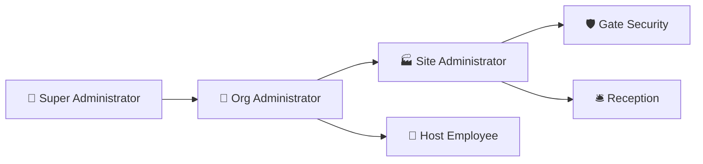

# Multi-Site Factory VMS — User Roles & Responsibilities

## 1. System Roles Overview

The system defines 6 specialized roles tailored for factory and organizational personnel:

---

## 2. Detailed Role Specifications

### 2.1 👑 Super Administrator (`SUPER_ADMIN`)
- **Scope**: Entire system across all organizations and factory locations.
- **Responsibilities**:
  - Provision new corporate organizations and primary admin accounts.
  - Global security configuration, platform updates, and global audit inspections.
  - Full override access on all entities.

### 2.2 🏢 Organization Administrator (`ADMIN`)
- **Scope**: All factory sites and departments belonging to their organization.
- **Responsibilities**:
  - Create and configure factory sites (`Baghpat Factory`, `Delhi Corporate Office`).
  - Create system users and assign role-based site scopes.
  - Review organization-wide visitor statistics and export consolidated analytics reports.
  - Inspect tamper-proof security audit logs.

### 2.3 🏭 Site Administrator (`SITE_ADMIN`)
- **Scope**: Single authorized factory plant location.
- **Responsibilities**:
  - Manage plant employee directory and department structures.
  - Configure plant-level policies (e.g. require approval for contractors/vendors, set default pass layout).
  - Manage visitor blacklisting and flagged profiles.
  - Oversee on-site rollcall and daily operations.

### 2.4 🛡️ Gate Security (`SECURITY`)
- **Scope**: Factory security checkpoints and turnstiles.
- **Responsibilities**:
  - Scan incoming and outgoing visitor QR badges using camera/tablet scanner.
  - Verify visitor identity, photo, host employee, and department.
  - Log vehicle entry details (license plate, vehicle type).
  - Check in walk-in visitors and print visitor passes.
  - Instantly generate **1-Click Emergency Evacuation Manifests** during fire drills or safety incidents.

### 2.5 🛎️ Front Desk Reception (`RECEPTION`)
- **Scope**: Plant main reception and visitor waiting lobby.
- **Responsibilities**:
  - Greet visitors and register walk-ins.
  - Capture visitor photo via webcam.
  - Search visitor directory by phone number for instant 1-click returning visitor auto-fill.
  - Print Standard A4 and 4"x3" Thermal Sticky visitor passes.
  - Check in pre-registered guests.

### 2.6 👤 Host Employee (`EMPLOYEE`)
- **Scope**: Self-service visitor management for employees.
- **Responsibilities**:
  - Pre-register expected guests, vendors, or auditors before they arrive.
  - Receive in-app notifications when their visitor checks in at the security gate.
  - Approve or reject pending visitor requests with notes.
  - View personal visitor history.

---

## 3. Daily Standard Operating Procedures (SOP)

### 3.1 Security Gate Check-In Procedure
1. Visitor arrives at security gate.
2. If visitor has pre-registered digital pass $\rightarrow$ Security opens **Gate QR Scanner** and scans the visitor's mobile QR code.
3. System verifies badge validity, displays visitor photo, host name, and department.
4. Security clicks **Check In Visitor** $\rightarrow$ Host employee receives an arrival notification.
5. If walk-in $\rightarrow$ Security/Reception registers details, captures photo, issues pass, and admits visitor.

### 3.2 Security Gate Check-Out Procedure
1. Visitor approaches exit gate.
2. Security scans visitor's pass QR code.
3. Security clicks **Check Out Visitor**.
4. System records exact exit timestamp and marks pass status as `USED` (preventing re-entry).
5. Visitor is automatically deducted from the active on-site headcount.
